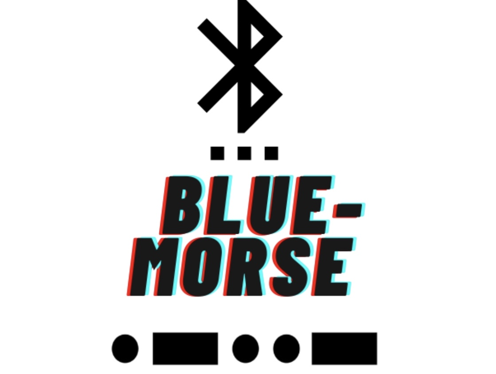

 
# Blue-Morse
## What is Blue-Morse?
Have you ever seen this?
.   
Yes.This is Bluetooth Shutter.This is able to take photo from afar.  
Blue-Morse is able to write text in morse-code by this shutter.
## DEMO

## INSTALL

```
sudo pip install git+https://github.com/roistaff/PyMorse
sudo pip install git+https://github.com/roistaff/Blue-Morse
```

## USAGE
Write this command in terminal.
```
blue-morse
```

### command option
```
blue-morse -dc (device name)
```
exsample:
```
blue-morse -dc "BT Shutter"
```
This command is setting device name.Default is "BT Shutter".If your device is other name ,use this command.  

```
blue-morse -os (txt)
```
This commands is showing morse-code exsample.
ezsample:
```
blue-morse -os "HELLO"
```

## Support
Blue-Morse is supported on Linux.__It is not supported on Mac and Windows.__ Sorry.
